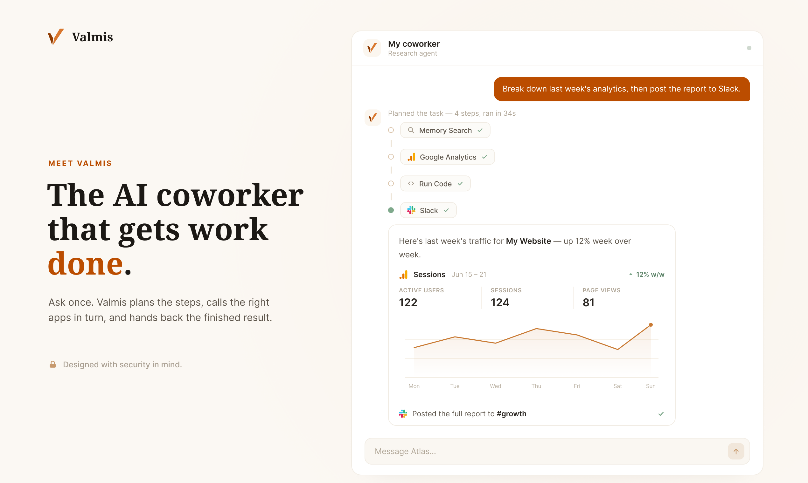
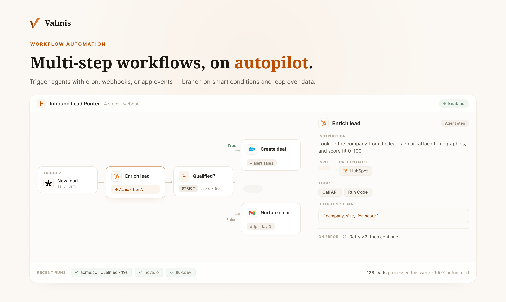
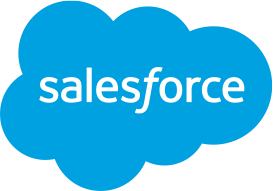
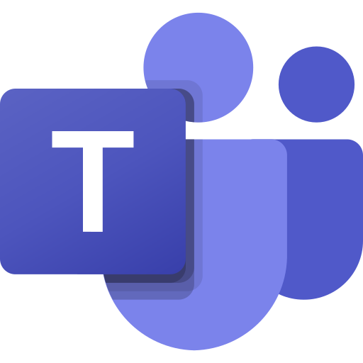
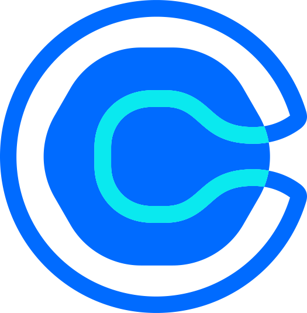

# Valmis - The OpenClaw alternative designed for work, with security in mind

## We are live on Product Hunt today!

Valmis is launching on Product Hunt today. If you like the project, we'd love your support.

<a href="https://www.producthunt.com/products/valmis?embed=true&utm_source=badge-featured&utm_medium=badge&utm_campaign=badge-valmis" target="_blank" rel="noopener noreferrer"></a>

--- 

Valmis is a cloud-based application for shipping AI agents for production work. It allows you to build a fleet of agents that can talk to 100+ business and productivity integrations. The system is designed with security in mind, and agents run in isolated containers, meaning AI never gets access to your API credentials or your host files.

Valmis is designed to automate workflows using AI. You can interact with your agent using the chat interface, or ask it to create multi-step workflows and trigger it with cron, webhook, or app events (new email, form submission, etc.).



## Why we built it

OpenClaw is a great tool to create personal assistants, but it is not for work. The biggest concern is security, as agents store credentials in their memory as plain text and sometimes send credentials directly to LLM providers.

Valmis addresses this issue by designing a **proxy system**: dockerized agent runtime can only request the host machine to make API requests by providing the relevant credential ID. The host then makes the actual request and returns the JSON data back to the agent runtime. Even the LLM API calls themselves are made using proxy. With this design, you can even turn off the internet access of the agent container while making it work.

Each agent has its own file system and is completely isolated from the host machine or from other agents.

Agents can only work for you when they have access (safely) to your apps. Our proxy system now supports 100+ business and productivity integrations, including all Google Workspace apps, Slack, Notion, Hubspot, Salesforce, and Figma. See [integrations](packages/utils/src/integrations/definitions) folder for all currently supported apps. Each agent you create can be assigned access to specific (or all) credentials, and this boundary is strictly followed at the code level. You can then talk to the agent to complete certain tasks, and agents will formulate proxy requests to the host machine to actually send the requests.

https://github.com/user-attachments/assets/82d1b6f7-2b07-482b-9f3a-67900ca9c72b

[Watch intro on Youtube](https://www.youtube.com/watch?v=-R6ea1UYge0)

Finally, you don't always want to manually ask your agents to work. You can automate multi-step workflows using our automation feature. Each workflow can be triggered by cron, webhooks, app events and it supports conditions and loops. You can create multi-step workflows using our workflow builder UI, or you can simply ask your agent to create one by providing a description.

Then it comes to why the project is called Valmis. Valmis is an Estonian word that means "completed" or "done"(Same in Finnish). This is because the project was inspired and designed in Estonia, Europe's digital nation. It also has the domain name valm.is that uses the Icelandic TLD, so the project is pretty Nordic. (Please do not open issues discussing whether Estonia is Nordic :) )

## What you can do with Valmis

### Build a fleet of agents

You can create a fleet of agents that act independently or in collaboration. Each agent can be assigned different credentials, different skills, and different knowledge bases. You can also assign different LLM providers for each agent, making sure less critical missions are done by less expensive models.

When given the proper permission, some agents can act as a team lead and have the authority to manage the workflow of other agents, forming a decision tree that is ultimately controlled by the human user.

### Build multi-step workflows

You can use our workflow builder canvas to create multi-step workflows that the agent will run automatically. This is especially useful when you have workflows that repeat every day or are triggered by specific events (form submission, Slack mentions etc.)

For better data security and control, you can limit the credentials and tools the agent can use in each step. You can also define the schema for the output of each step for more efficient data mapping. You can add conditions and loops to the workflow. Conditions can by smart (you describe the condition using human language and AI decides if the condition is met) or strict (compare values rigorously using programming logic).



### Agents have cross-session memory

Each agent has its own memory system that is organized into four categories: episodic (what happened), semantic (durable facts), procedural (rules and constraints), and working (short-lived context). This is a mechanism inspired by cognitive-memory research.

Your agents are able to automatically write memory when you tell them anything worth remembering or when it discovers something that might be useful in the future. Agent memory is persistent across sessions, meaning the more you interact with the agent, the more it will know your workflow. When a session ends, the agent automatically distills what it learned so the next conversation starts smarter. You can also instruct the agent to modify or remove memory items.

Valmis system uses `pgvector` to store and fetch memories. Each memory item is embedded using embedding models, and the search is done semantically using text embedding.

### Connect to your tools safely with proxies

You can connect to more than 100 business and productivity apps using an API key or Oauth2 authentication. The credentials are encrypted with AES-256-GCM and are stored in your database. AI agents never get access to the credentials themselves, but instead call these APIs through the host machine using a proxy. Theoretically, you can configure your agent runtime to have no access to the internet, and it will still work.

Here is a preview of some of the apps we already support.

<table align="center">
  <tr>
    <td align="center" width="60"><br>Slack</td>
    <td align="center" width="60"><br>Figma</td>
    <td align="center" width="60"><br>Gmail</td>
    <td align="center" width="60"><br>Notion</td>
    <td align="center" width="60"><br>Google Drive</td>
    <td align="center" width="60"><br>Google Calendar</td>
  </tr>
  <tr>
    <td align="center" width="60"><br>Google Sheets</td>
    <td align="center" width="60"><br>Stripe</td>
    <td align="center" width="60"><br>Shopify</td>
    <td align="center" width="60"><br>Discord</td>
    <td align="center" width="60"><br>Jira</td>
    <td align="center" width="60"><br>Google Analytics</td>
  </tr>
  <tr>
    <td align="center" width="60"><br>Salesforce</td>
    <td align="center" width="60"><br>Trello</td>
    <td align="center" width="60"><br>Asana</td>
    <td align="center" width="60"><br>Teams</td>
    <td align="center" width="60"><br>Outlook</td>
    <td align="center" width="60"><br>Dropbox</td>
  </tr>
  <tr>
    <td align="center" width="60"><br>Airtable</td>
    <td align="center" width="60"><br>Telegram</td>
    <td align="center" width="60"><br>Twilio</td>
    <td align="center" width="60"><br>Calendly</td>
    <td align="center" width="60"><br>monday.com</td>
    <td align="center" width="60"><br>WhatsApp</td>
  </tr>
  <tr>
    <td align="center" width="60"><br>Linear</td>
    <td align="center" width="60"><br>Canva</td>
    <td align="center" width="60"><br>Cloudflare</td>
    <td align="center" width="60"><br>Supabase</td>
    <td align="center" width="60"><br>Reddit</td>
    <td align="center" width="60"><br>HubSpot</td>
  </tr>
</table>

...and many more, including QuickBooks, Xero, Stripe, WooCommerce, BigCommerce, Intercom, Zendesk,
Freshdesk, Pipedrive, ActiveCampaign, Klaviyo, SendGrid, Twilio, Calendly, Cal.com, GitHub, Jira,
Confluence, ClickUp, monday.com, Todoist, Contentful, Webflow, WordPress, Ghost, Miro, Canva,
ElevenLabs, Pinecone, and the generic HTTP connectors (Basic, Bearer, header, and query auth) for
anything not on the list. Every integration is one YAML file in
[packages/utils/src/integrations/definitions/](packages/utils/src/integrations/definitions/), so the
catalog is easy to extend.

### Browser automation made simple

When enabled, agents can operate a headless browser, navigate, fill forms, clicks, read pages, and take screenshots. Browsers are also managed by the host machine so agents interact with them using proxy. Agents have access to their own browsing history and session cookies, which you can manually reset or manage.


### Other important features

- **Human in the loop:** Whenever there is a critical decision to make, the agent pauses and ask the human with a set of options.
- **Use any LLM provider:** You can connect to any LLM provider and use their chat or embedding models flexibly. We already support nearly 200 models from 20 providers (OpenAI,
  Anthropic, Google, Mistral, Cohere, and more), you can also use OpenRouter for more choices.
- **Knowledge base:** Connect your enterprise knowledge base using Google Drive, Dropbox, Notion, or simply upload files. Knowledge base files are also processed as memories for agents to ensure quicker knowledge recall.
- **Skills system:** You can install third-party skills from Github, or create your own self-evolving skills that learn from you as you interact with it.

### Something fun

Valmis is probably the first AI agent that is able to play real chess with legit moves. We all know [LLMs are notoriously terrible at playing chess and always hallucinate moves](https://www.youtube.com/watch?v=c5JDaZ4tEaY). So we added a tool to the agent called chess-engine, which basically requires the agent not to rely on text generation to produce moves, but instead to produce each move strictly based on the calculation of a lightweight chess engine built in. And AI can be a great (and sportsmanlike!) chess player.


## Getting started

### With Docker (recommended)

The whole system runs from a single Docker Compose file: the app (frontend on 3000, backend on 4000),
a pgvector-enabled PostgreSQL, and a Docker socket proxy for the agent runtime.

```bash
# Use .env.example if you want to configure everything
cp .env.min.example .env
# Fill in the secrets — at minimum:
#   CREDENTIAL_ENCRYPTION_KEY, JWT_SECRET, PROXY_TOKEN_SECRET
# Generate each with:
#   node -e "console.log(require('crypto').randomBytes(32).toString('hex'))"

docker compose up -d
```

Then open http://localhost:3000 and create your first admin user at `/setup`.

## License

Valmis is released under the [Apache License 2.0](LICENSE).
